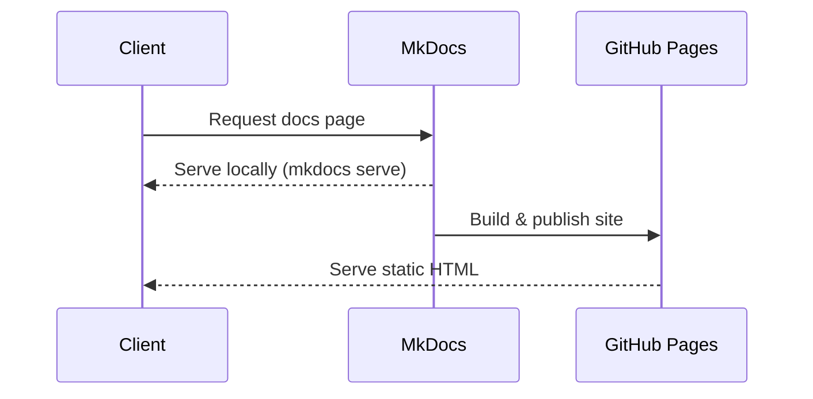

# Mermaid POC

Trang này dùng để kiểm tra khả năng hiển thị sơ đồ Mermaid trong MkDocs.

## Flowchart: Build & Deploy Docs

```mermaid
flowchart LR
  A[Write Markdown] --> B[mkdocs build]
  B --> C[Static site in site/]
  C --> D[GitHub Pages Deploy]
```

## Sequence: Client → MkDocs → GitHub Pages

```mermaid
sequenceDiagram
  participant Client
  participant MkDocs
  participant GHPages as GitHub Pages

  Client->>MkDocs: Request docs page
  MkDocs-->>Client: Serve locally (mkdocs serve)
  MkDocs->>GHPages: Build & publish site
  GHPages-->>Client: Serve static HTML
```
